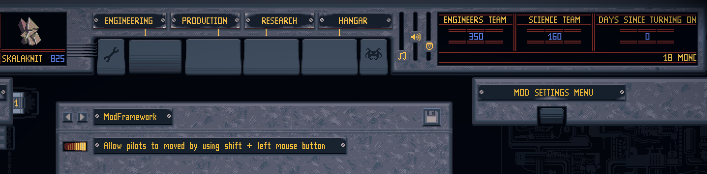

# ModFramework - Mod Settings Menu
#### [Back to overview](../Overview.md)
---

The ModFramework allows for users to change mod settings via an in-game mod settings menu.

### Where to find it?

Users can find the menu by opening the Engineering tab and clearing the table of any item. after that a menu button in the top right will appear to open the mod menu. 

### How does it work?

- A mod [registers](./AddingModSettings.md) a setting in the framework. 
    - At the registration a description is set to explain what it does.
    - A default value is set.
- The framework tracks the current settings and saves them when the game saves. 
- Users can change the setting in the menu and the changes are instantly updated. 
- The affect of the setting in the game is up to the mod creator.
- With the save icon users can override the default settings. So settings can persist across new saves.

### Why doesn't my mod or setting showup? 

By default it will show only the settings options for the ModFramework itself. Other mods need to [register](./AddingModSettings.md) the desired settings to the framework. After that page buttons will appear to switch to the other mods and change the registered settings.

### What is supported?

Currently there is only support for settings of type boolean.   
The setting descriptions have localization support.

---
#### [Back to overview](../Overview.md)
---
##### [Home](../../../readme.md)