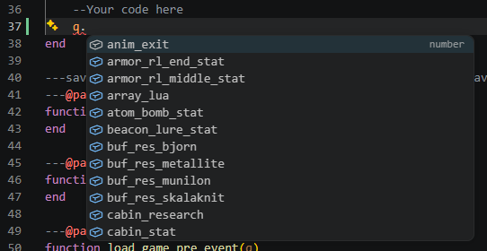
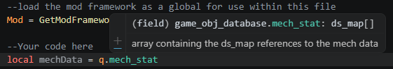
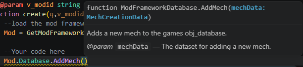
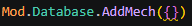
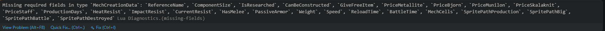
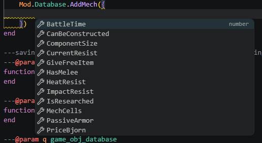
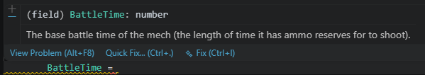
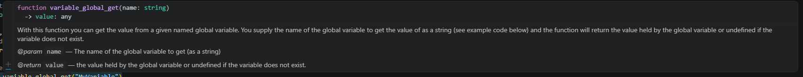

# How to use the documentation

#### [Back to overview](./Overview.md)
---

This guide assumes that you are using the setup described in "[Getting started](./GettingStarted.md)"

The "[ModTemplate](../../src/ModTemplate/)" provides you with 2 documentation folders.
- **_GameDefinitions**   
_This will provide the documentation files on both the game objects and the functions that are exposed._
- **_ModFrameworkDefinitions**   
_This will provide the documentation files on the ModFramework objects and functions._

By having these files in your mod folder the your IDE (vscode) can be told what is possible when use a variable.

Lets show some examples on how to use the documentation.

## Example on object fields

Given this code block (_taken from the ModTemplate_):

```lua
---One time script when the game is started
---@param q game_obj_database
---@param v_modid string
function create(q,v_modid)
	--load the mod framework as a global for use within this file
	Mod = GetModFramework()

	--Your code here
end
```

The IDE is told that the **q** param for the create function is of type **game_obj_database**. This allows the IDE to know what fields are hidden inside this variable.

When you start typing you will see a popup like this:


It tells you that **q** contains fields:
- What fields there are available.
- What names they have.
- And what type they are.

In some cases the field have gotten a comment line explaining more detail. This can be seen when hovering over the fully typed field like so:


In this case the documentation is telling us the field **mech_stat** is of type **ds_map[]** meaning an array of ds_map items. And the extra comment explains that the ds_map references contain the mech data.

As with most game types not every field is commented. There are many fields and not all of them are useful to creating mods. Also the game state might affect what fields are actually populated with data. So even with the documentation it wise to test what is in the field, before simply using it.

## Example on ModFramework functions

Similarly to defining the type of a param the return type of functions can also be defined. The **GetModFramework()** function that is included defines that it returns an object of type **ModFramework**. Like with q in our previous example typing will reveal its contents.

Unlike the gameobjects the **ModFramework** contains mostly functions or variables with function collections.

When using a function from the framework the documentation again provides helpful info. For example typing **Mod.Database.AddMech()** will show you:


It explains that the function:
- Expects a param with name **mechData** of type **MechCreationData**.
- The function description _Adds a new mech to the games obj_database_.
- The Param description _@param mechData - The dataset for adding a new mech._
- There is no _@return_ listed so the function does not provide a return value.

To use this information you don't need to know full know what the type **MechCreationData** means as this is a custom type also called a class. We only need to know that we can either pass an variable that has the same type or create our own type.

Since we don't have a variable of the same type we can create our own. Since its not one of the lua base types like _string, boolean, number_ we can know its an object and to create a new object we simply type {} to create an new empty object. lets see what that gets us:   


The yellow squiggly line under our added object shows us a warning that something is not quite correct. By hovering over it with the mouse we can get additional info.   


Lets have IDE do the heavy lifting of fixing this for us. Start by adding a linebreak to open the {} to a new line. We do this to make the additions easier to read. Next while having the cursor in between the {} we use the keyboard shortcut for **_Trigger Suggest_ (ctrl+space)** and we are shown the following:   


We get al list of fields that this type expects, lets add the first on in the list since its already selected we can simply press **_enter_** and it will add the field text to the object. Next we add an equals sign to tell the IDE we are adding a field and not a global variable. Now we can hover over the BattleTime text to see what the field actually means and wants.   


We get the info that this field is of type **_number_** along with the comment _The base battle time of the mech (the length of time it has ammo reserves for to shoot)._ We now no we have to provide it with a number and that the number relates to the ammo reserves for the mech. In some other cases it might specify a range. or like this case the range is left intentionally open for experimentation. 

Finding the value that you want to use is usually not in the scope of the documentation. For our example we can use the number 3 as this is the same value as the coffin/miner mech uses. Then since the yellow squiggly line is not gone we can repeat to add a the next missing field.

If we keep doing that we can end up with a complete data set to add our mech.

## Example on game function

The game exposes some of the game function to the modders. For most the documentation provides the same type info as for the ModFramework functions.

```lua
local value = variable_global_get("MyVariable")
```

Hovering over the function will provide you with alle the needed info:   


Most exposed functions are native gamemaker functions and additional info for them can be found on the [gamemaker documentation](https://manual.gamemaker.io/lts/en/index.htm#t=Content.htm).

## Summary
We get code highlights provided by the IDE by having the documentation simply in our workspace/mod folder. It will tell us things like:
- What field are available in variables of a type.
- What functions are available in variables of a type.
- What the return type is for a function.
- What the needed params are for a function.
- Info on the requested params of a function: type and description
- Warning highlighting on for example: 
    - Missing fields.
    - Missing params.
    - Trying to access a field that might not exists.
    - Trying to access a function that might not exists.
    - ect.
- Comment descriptions on fields, functions, params and returns

---
#### [Back to overview](./Overview.md)
---
##### [Home](../../readme.md)
