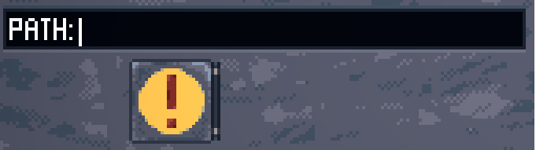
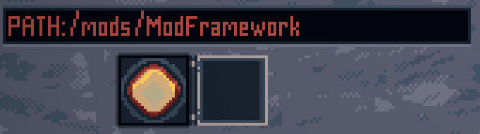

# ModFramework - Upload to Steam workshop
#### [Back to overview](./Overview.md)
---
## Checklist

Before we start clicking check if you have everything:
- Are you uploading or updating? if you are updating check [here](./UpdatingWorkshopMod.md)
- Did you test your mod?
- Did you remove any debug functions? (message boxes, cheat unlocks, ect)
- Did you update your thumbnail.jpg in the mod folder, This will be set as your mods primary banner.
- Did you edit the info.txt, this wil determine in what categories the mod will be listed.
- Did you edit the readme file, example: Left info for other modders, a changelog on whats included, ect

       

## Step by step
- Start the game and open de mod list
- On the left there is a banner "UPLOAD TO WORKSHOP"   
Click on the path box below it and enter the name of your mod folder and check for the correct capitalization.   

- Unselect the path box. It should now show PATH:/mods/YourModFolder
- When the info is correct click once to open the Yellow button below the path box.   

- And click a second time to upload your mod to steam.
- It wil upload in private mod so you can edit the description and add extra images. This can all be done trough your steam client or the steam webpage.

## optional
Make a thread in the mech engineer discord #mods-collection. and leave a zip file for your mod for the non steam users.

---
#### [Back to overview](./Overview.md)
---
##### [Home](../../readme.md)